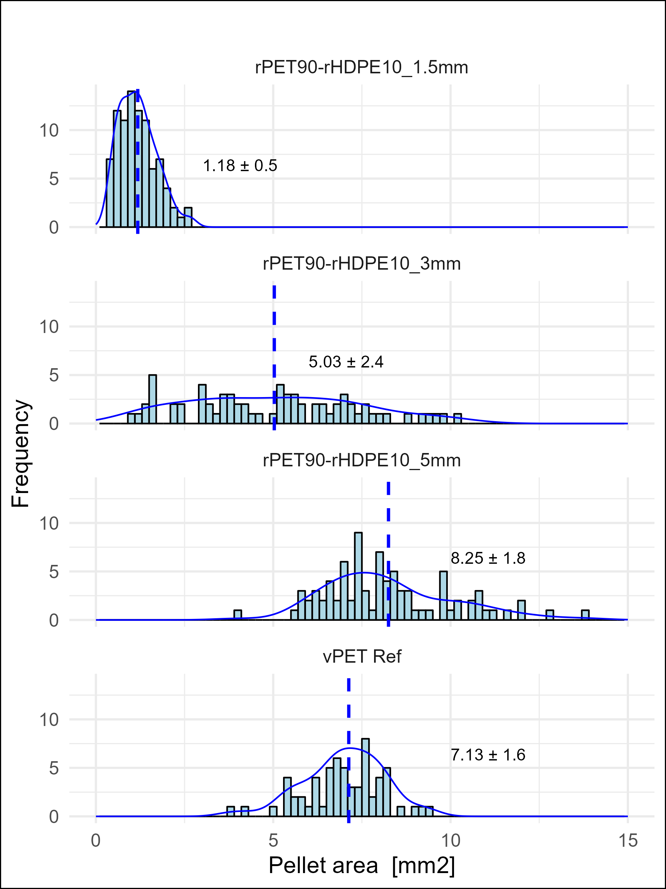

```{r setup, include=FALSE, echo=FALSE}
library(kableExtra)
library(tidyverse)
library(readxl)
knitr::opts_chunk$set(echo = FALSE, fig.retina = 3, 
                      message = FALSE, warning = FALSE,
                      out.width = '90%',
                      fig.align = 'center',
                      fig.pos = "H",
                      out.extra = "")
options(knitr.kable.NA = '')
```

# Introduction
<!-- Plastics topic -->
\linenumbers


# Introduction

Here are two sample references: @Feynman1963118 [@Dirac1953888].

# Methodology

# Results

## Granulometry

Figure \@ref(fig:figure5) is imported.

```{r figure5, fig.cap="Granulometry", out.width='80%'}

```


# References {-}

